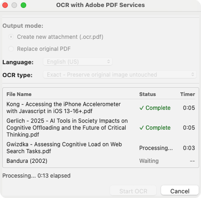
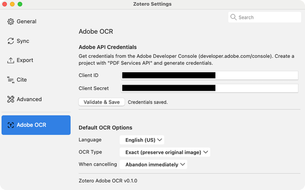
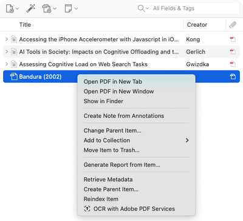

#  Zotero Adobe OCR

A Zotero plugin that adds OCR (optical character recognition) to PDF attachments using the [Adobe PDF Services API](https://developer.adobe.com/document-services/apis/pdf-services/). It can serve as an alternative to Zotero's built-in OCR, which relies on Tesseract.

## Prerequisites

- **Zotero 7** or later
- **Adobe PDF Services API credentials** (Client ID and Client Secret)

  The [free tier](https://developer.adobe.com/document-services/docs/overview/limits/#free-tier) includes a set of document transactions per month; see [Adobe's usage limits](https://developer.adobe.com/document-services/docs/overview/limits/) for current details. To create credentials:

  1. Sign in to the [Adobe Developer Console](https://developer.adobe.com/console/projects)
  2. [Create a new Project](https://developer.adobe.com/developer-console/docs/guides/getting-started#projects)
  3. [Add the PDF Services API with OAuth Server-to-Server credentials](https://developer.adobe.com/developer-console/docs/guides/services/services-add-api-oauth-s2s)

  _Note: Some institutional Adobe accounts (e.g. university or enterprise) may restrict access to the Developer Console. If you encounter issues, try using a personal Adobe account._

## Installation

1. Download the latest `.xpi` file from [Releases](https://github.com/tshippen/zotero-adobe-ocr-plugin/releases/latest) ([all releases](https://github.com/tshippen/zotero-adobe-ocr-plugin/releases)).

   If you are using Firefox, right-click the `.xpi` link and select "Save Link As..." to download the file instead of opening it.

2. In Zotero, go to `Tools` > `Plugins`, click the gear icon, and select `Install Plugin from File...`.

3. Select the downloaded `.xpi` file.

## Setup

Open Zotero `Settings` > `Adobe OCR` and enter your Client ID and Client Secret. Use the Validate button to confirm they are working. You can also set default preferences for OCR language, output type, and cancellation behavior from this pane.

## Usage

Select one or more items in your library, right-click, and choose **OCR Selected PDFs**. The dialog allows you to choose a language, output type (searchable image or exact), and whether to overwrite the original PDF or create a new attachment. Progress is tracked per-file during processing.

## Contributing

This is a personal project, and I'm not accepting pull requests at this time.
Bug reports, feature requests, and other feedback are very welcome, please [open an issue](https://github.com/tshippen/zotero-adobe-ocr-plugin/issues)!

## Disclaimers

### Disclosure of Generative AI Use

This project was created with assistance from Generative AI, specifically Claude Code. As the author, I don't consider the way that Claude Code was used to be "vibe coding", but want to be transparent about its use in this project. Code that I contribute to this project in the future bears this same disclaimer unless otherwise noted.

### Use of Adobe REST API

This plugin is an independent, third-party project. It is not affiliated with, endorsed by, or supported by Adobe.

OCR processing is performed by Adobe's cloud service. When you use this plugin, your PDF files are uploaded to Adobe's servers. Refer to [Adobe's terms of service](https://www.adobe.com/legal/terms.html) for their data handling policies.

Adobe and Adobe PDF Services are either registered trademarks or trademarks of Adobe in the United States and/or other countries.

### Icon

Plugin icon from [Tabler Icons](https://tabler.io/icons) (MIT License).

### Use of Template

This project uses the [zotero-plugin-template](https://github.com/windingwind/zotero-plugin-template) created by [windingwind](https://github.com/windingwind).

### License

AGPL. See [LICENSE](LICENSE) for details.
